# Boeing 747 Stability Simulations - Linearized Longitudinal Dynamics Sets

## Question 1 - Open Loop:
### **Part a.)**
Implementing the conditions of a Boeing 747 flying at an altitude of 40,000 feet, using the values provided from page 165 of Etkin, the full A matrix is provided below:

$$
A =
\begin{vmatrix}
-0.0069 & 0.0139 & 0 & -9.81 \\
-0.0905 & -0.3149 & 235.8933 & 0\\
3.8918E-4 & -0.0034 & -0.4281 & 0\\
0 & 0 & 1 & 0\\
\end{vmatrix}
$$
 

To calculate the natural frequency, dampening ratio, and time constant - the following relations were used:
 

$$
\omega_n = \sqrt{\omega^2 + n^2},\,\,\,\,\,\,\,\,\, \zeta = -\frac{n}{\omega_n},\,\,\,\,\,\,\,\ \tau = -\frac{1}{n}
$$
 

Where n and $\omega$ are the real and imaginary parts of the eigenvalues, respectively. The numerical values for the variables above for both the phugoid and short period mode are provided below:
   

<ins>Short Period Mode: </ins>

Eigenvalues $\lambda_{1,2}$: -0.3717 $\pm$ 0.8869i  

Natural Frequency $\omega_n$: 0.9616 [rad/s]  

Dampening Coefficient $\zeta$: 0.3865  

Time Constant $\tau$: 2.6906 [s]  
 

<ins> Phugoid Mode: </ins>

Eigenvalues $\lambda_{1,2}$: -0.0033 $\pm$ 0.0672i  

Natural Frequency $\omega_n$: 0.0673 [rad/s]  

Dampening Coefficient $\zeta$: 0.0489  

Time Constant $\tau$: 304.025 [s]  

 

As can be seen from the open loop A matrix and it's corresponding eigenvalues, the Boeing 747 is stable as the the eigenvalues for both the short period mode and the phugoid mode have negative real parts, meaning that the envelope driving the imaginary part's ocsillatory motion decays, driving the perturbation to nominal conditions. It can also be seen that the damping coefficient is greater than 0, which also shows stability.

### **Part b.)**
To compute the matrix $A_{PWD}$ and the vector $B_{PWD}$ in terms of the linear vector-matrix differential equation, the following equations from class were implemented:
 

$$
\mathbf{\Delta \dot{y}} = 
\begin{vmatrix}
-0.0069 & 9.81 \\
3.89E-4 & 0 \\
\end{vmatrix}
\mathbf{\Delta y} + 
\begin{vmatrix}
-4.643 \\
-0.418 \\
\end{vmatrix}
\mathbf{\Delta u}
$$
 

Where:

$$
\mathbf{\Delta \dot{y}} = 
\begin{vmatrix}
\Delta \dot{u} \\
\Delta \dot{\theta}\\
\end{vmatrix}
,\,\,\,\,\,\,\,\,\,\,
\mathbf{\Delta y} = 
\begin{vmatrix}
\Delta u \\
\Delta \theta \\
\end{vmatrix}
,\,\,\,\,\,\,\,\,\,\,
\mathbf{\Delta u} =
\begin{vmatrix}
\Delta \delta_e \\
\end{vmatrix}
$$
 

### **Part c.)**
To compare the accuracy of the PWD approximation with respect to the full A matrix, a comparison of the eigenvalues is needed. The eigenvalues for both modes of the full A matrix are compared to the eigenvalues of the PWD approximation are given below: 
  

<ins>Eigenvalues:</ins>

$A_{PWD}$ = -0.0034 $\pm$ 0.0611i  
$A_{full}$ = -0.0033 $\pm$ 0.0672i (Phugoid Mode)  
$A_{full}$ = -0.3717 $\pm$ 0.8869i (Short Period Mode)  
 

Since the eigenvalues tell how the system will respond, the natural frequency and damping ratio are purely indications of how well the approximation predicted the eigenvalues. Since the $A_{PWD}$ matrix is only 2x2, there is only one conjugate pair corresponding to one mode. To make a comparison to the full A matrix, the values of the phugoid mode were compared as they were much closer. The values are provided below:

| | $\omega_n [\frac{rad}{s}]$ | $\zeta $ |
|:----------:|:-------:|:-------:|
| $A_{full}$ |  0.0673 |  0.0489 |
| $A_{PWD}$  |  0.0611 |  0.0561 |
| \% Error   |  9.13   |  14.86  |
 

After analyzing the eigenvalues and the characteristics of these eigenvalues, namely, the natural frequency and the dampening ratio, it was noticed that the PWD approximation is relatively accurate as the deviations were small. Considering the simplifications of decoupling the 4x4 matrix to that of a 2x2 matrix and only getting a maximum error corresponding to the dampening ratio, which was found to be 14.89\%, makes the PWD approximation very useful.
 

## Question 2 - Closed Loop:

### **Part a.)**
When implementing a closed loop speed-to-elevator feedback loop, we first had to set a target zone for where we wanted our phugoid eigenvalues to ideally be. This target zone is defined by the ranges of our time constant and dampening ratio. The time constant $\tau$ has to be in the range - 0 $\le \tau \le$ 20 [seconds], and the dampening ratio $\zeta$ has to be in the range - (0.9 $\le \zeta \le$ 0.95). The values of the real values of the eigenvalues only depend on the time constant, so these values were found over the corresponding range first by using the relation: $n = -\frac{1}{\tau}$, where n is the real part of the eigenvalues. Once a vector of the real parts of our target zone were found, the imaginary parts of the eigenvector could be found by the relation: $\omega = n \sqrt{(\frac{1}{\zeta})^2-1}$, where we implemented each individual real part, n, and calculated the imaginary part over the range of $\zeta$. After this was done over all n, inside it's corresponding vector, the bounds were found and are plotted below:  

**Target Zone Bounds:** 

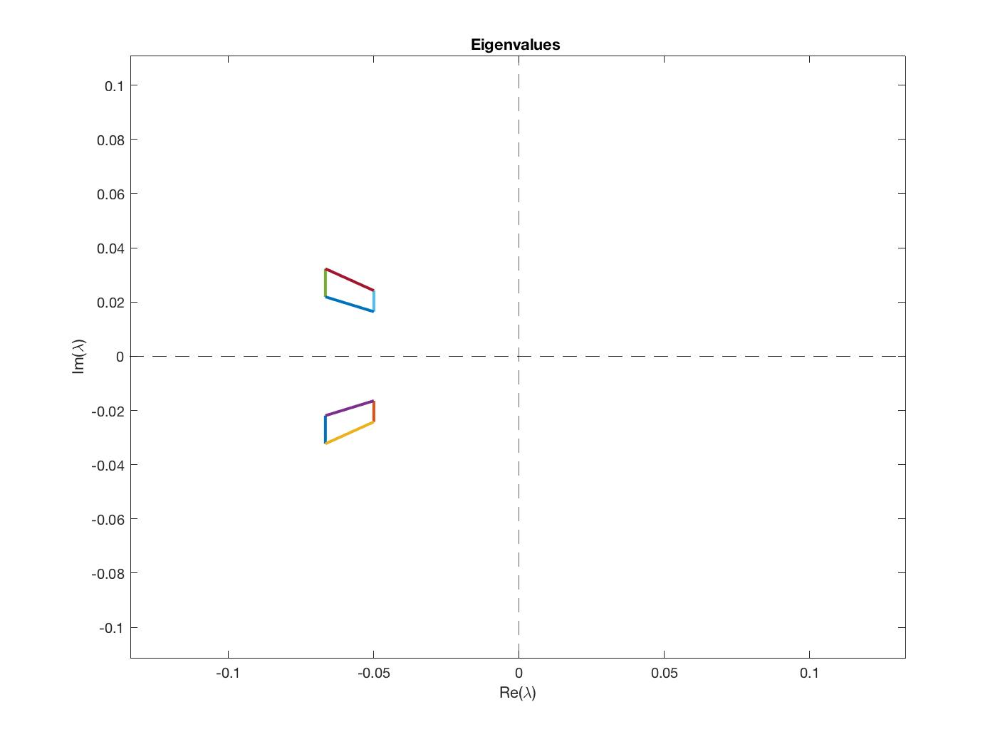
 

### **Part b.)**
To get a better understanding of what proportional gain we should use for a proportional only  controller, a plot of the eigenvalues for the range of proportional gain values, $|k_1| = 0:0.00001:0.01$ was implemented. This was done by using the following relation and plugging into the linear vector-matrix differential equation from before:
 

$$
\mathbf{\Delta\delta_e} = 
\begin{vmatrix}
-k_1 & 0\\
\end{vmatrix}
\begin{vmatrix}
\Delta u \\
\Delta \theta \\
\end{vmatrix}
$$
 

To find the ideal values for the proportional gain, $k_1$, we took the $k_1$ that corresponded to the eigenvalues with the closest distance to the target region. It should be noted that we took this distance for only the eigenvalues that had both imaginary and real parts since eigenvalues with only real or imaginary parts are unstable. Plots of the the eigenvalues corresponding to the shortest distance are plotted below. Since larger  negative real parts have more stable behavior the largest negative real part that also has imaginary parts was also plotted in conjunction to the the closest eigenvalues.  

**Finding Ideal Proportional Gain Values:**  

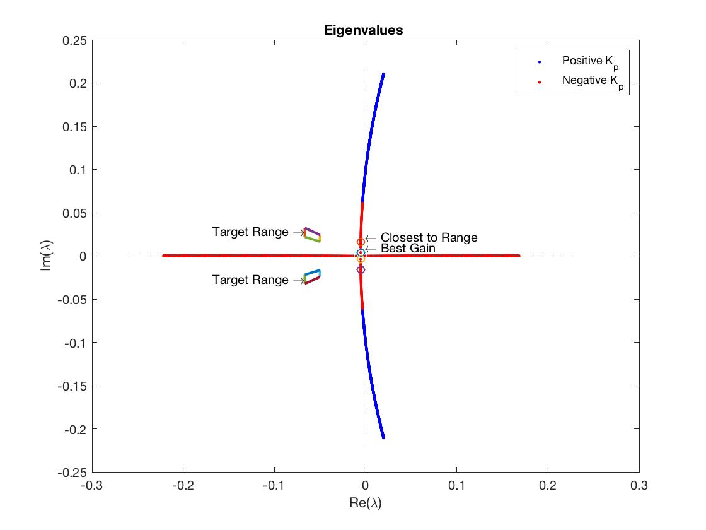
 

As can be seen from the plots, negative $k_1$ values have values that represent a more stable system, where the positive $k_1$ values are less stable. Therefore, positive $k_1$ values are ideal since they have larger negative real parts of their eigenvectors, which drives the systems envelope to decay faster back to nominal conditions. The best $k_1$ values, found from the closest distance circled in the plots, and the $k_1$ values with the largest negative real parts, are given below:
  

**$k_1$ Values:**
 

$k_1$ = -0.0009 (Largest Negative Real Part)  
$k_1$ = -0.00084 (Closest Distance)  

### **Part c.)**
When implementing the closed-loop PWD model response for proportional-only control, the two different gain values of $k_1$ were used and plotted against each other for comparison. The plots for the variables of $\Delta u, \Delta \theta, and \Delta \delta_e$ are plotted versus time in the following plots for a perturbation of $\Delta u$ = 10 $\frac{m}{s}$ :  

**Close-Loop for P-Only Control:** 

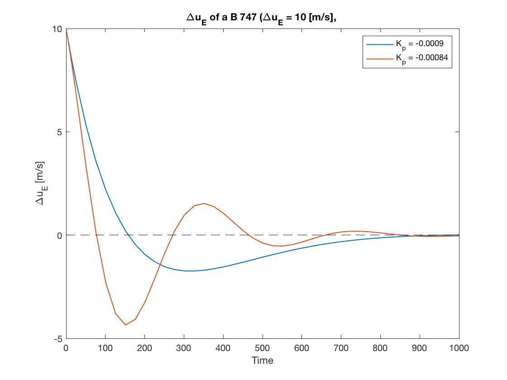 

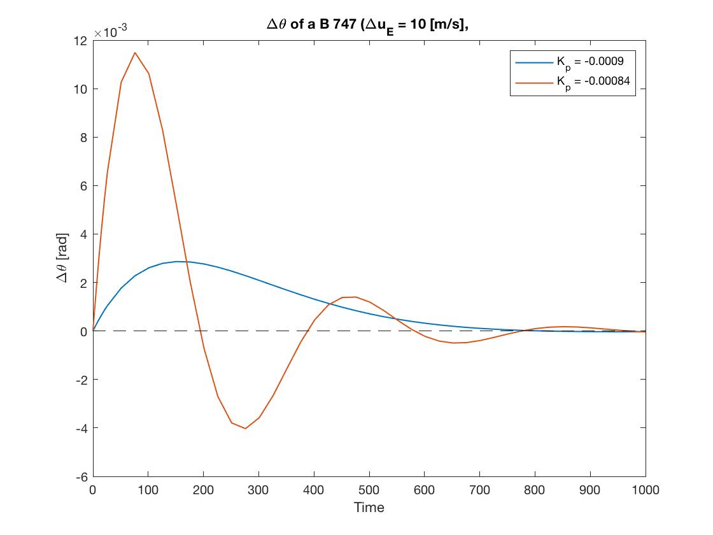 

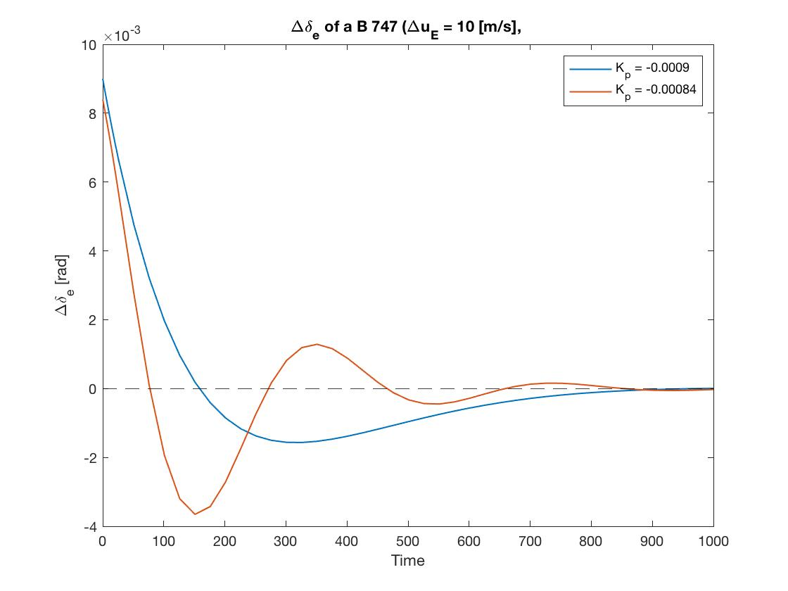 

As can be seen from the plots, the realization about larger negative real parts ended up being valid as the $k_1$ value for this case provided greater dampening and stability as the state values returned to zero perturbation much quicker.  

### **Part d.)**
Designing a full PD controller for the linearized approximation, to again attempt to get in the target range of eigenvalues, the control input vector for a speed-to-elevator feedback loop can be represented by: 

$$
\mathbf{\Delta \delta_e}= -k_1\Delta u - k_2\Delta\dot{u}
$$
 

A range of $k_1$ and $k_2$ values were then varied over reasonable ranges until the eigenvalues were with in the target range. A graphical representation of this is provided below:  

**Eigenvalues Varying $k_1$ and $k_2$:** 

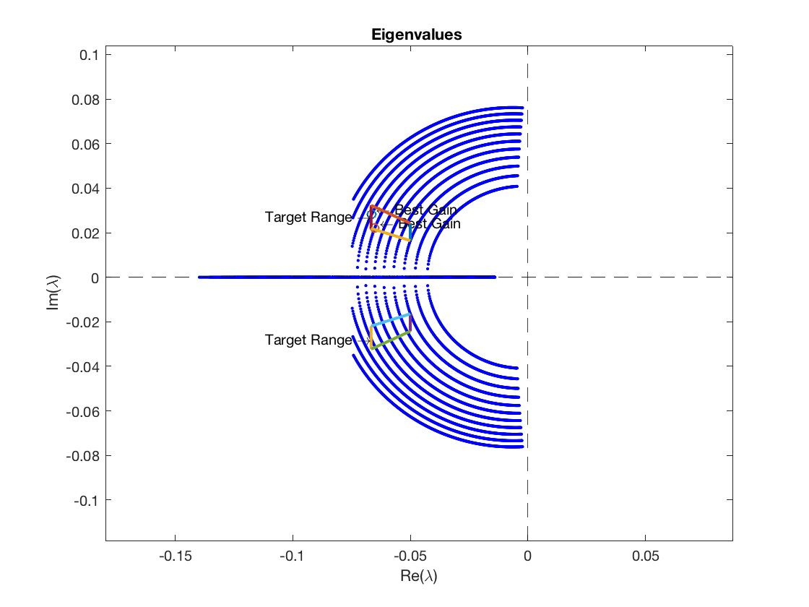
 

To then find the ideal gains corresponding to the eigenvalues in this region, the values with the largest negative real parts were chosen as the larger the negative real part the more stable the system should be. A plot of the chosen eigenvalues and the corresponding gain values are provided below:  

**Largest Negative Real Part:** 

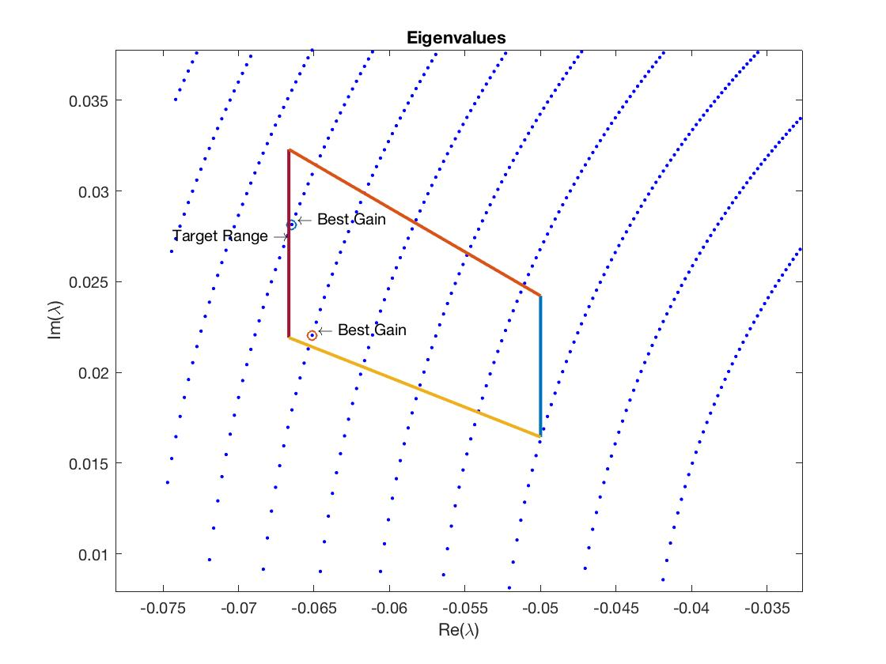  

<ins>Gain 1:</ins>  
$k_1$ = 0.0002  
$k_2$ = 0.0269   

<ins>Gain 2:</ins>  
$k_1$ = 0.0001  
$k_2$ = 0.0263    

### **Part e.)**
Implementing the closed-loop response for the PD controller and comparing the gains that we found for the two cases with the largest negative real parts for a perturbation of $\Delta u$ = 10 [m/s], the following state variable response were found:  

**Close-Loop PWD Approximation for PD-Control:** 

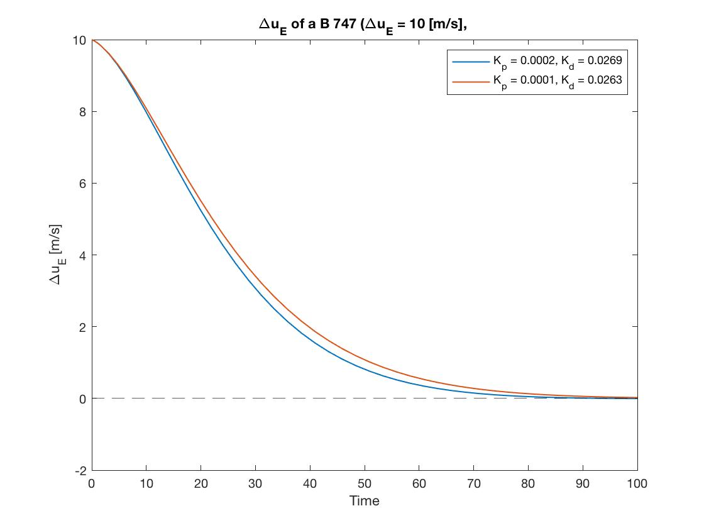 

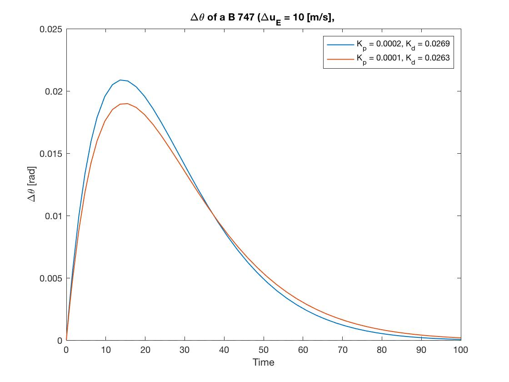 

As illustrated in the plots above, the PD response to the perturbation about $\Delta u$ = 10 [m/s], returned much faster to its nominal state in comparison to the P-only controller. This makes intuitive sense since implementing derivative control should increase the dampening of the system as we saw. After comparisons of the state response, the two sets of gains gave very similar results. For the rest of this document we take the optimal gains to be $k_1$ = 0.0001 and $k_2$ = 0.0263, as the overshoot for $\Delta \theta$ was marginally better. 

## Question 3 - Full Linearized Longitudinal Dynamics:

### **Part a.)**
To calculate the eigenvalues of the closed loop PD-controlled phugoid eigenvalues for the full dynamics model, the following linear algebra was needed:  

From Before we have the expression:
$$
\mathbf{\Delta\dot{y}}= A\mathbf{\Delta y} - B\mathbf{\Delta u}
$$
 

Where:
$$
\mathbf{\Delta u} = 
\begin{vmatrix}
-k_1 \Delta u - k_2\Delta\dot{u} \\
0\\
\end{vmatrix}
\,\,=\,\ K_{mat1}\Delta\mathbf{y} + K_{mat2}\Delta\mathbf{\dot{y}}
$$
 

$$
K_{mat1} = 
\begin{vmatrix}
-k_1 & 0 & 0 & 0 \\
0 & 0 & 0 & 0 \\
\end{vmatrix}
,\,\,\,\,\,\,\,\,\,
K_{mat2} = 
\begin{vmatrix}
-k_2 & 0 & 0 & 0 \\
0 & 0 & 0 & 0 \\
\end{vmatrix}
$$
 

Further:
$$
\mathbf{\Delta \dot{y}} = A\mathbf{\Delta y} + B K_{mat1}\mathbf{\Delta y} + B K_{mat2}\mathbf{\Delta \dot{y}} 
$$
 

Lastly, when simplified:

$$
\mathbf{\Delta \dot{y}} = [(I_{4x4} - B K_{mat2})^-1(A+B K_{mat1})]\mathbf{\Delta y}
$$

Now that we have the full linearized longitudinal dynamics model for PD-control, the eigenvalues for the phugoid mode can now be calculated by finding the eigenvalues with a smaller negative real part. We know this to be true because the decay of the envelope is smaller for a phugoind mode, as it lasts much longer. The phugoid eigenvalues are as follows:  

<ins>Full Closed Loop PD-Controlled:</ins> 

$\lambda_{1,2}$: -0.3078 $\pm$ 0.9174i (Phugoid Mode)  

<ins> PWD Closed Loop PD-Controlled: </ins> 

$\lambda_{1,2}$: -0.0651 $\pm$ 0.0220i 

The eigenvalues of the PWD approximation are much different than the full linearized set. The coupled nature of the state variables inherently gives phugoid eigenvalues with much larger negative real parts than the approximation gives. This meaning the the full model is more damped than the PWD approximation, while also having different oscillatory motion due to the different imaginary eigenvalues. This is to be expected as decoupling variables that have derivative control will play a much larger role than just decoupling P-only control since the state variables are much more interrelated in the closed loop matrix. 

### **Part b.)**
When simulating the the closed-loop response of the full dynamics model, for the initial conditions: $[\Delta u(0), \Delta w,\Delta q, \Delta\theta]^T = [10, 0, 0, 0]^T$, the following response for each of the state variables and the elevator response are as follows:  

**Full Linearized Longitudinal System:** 

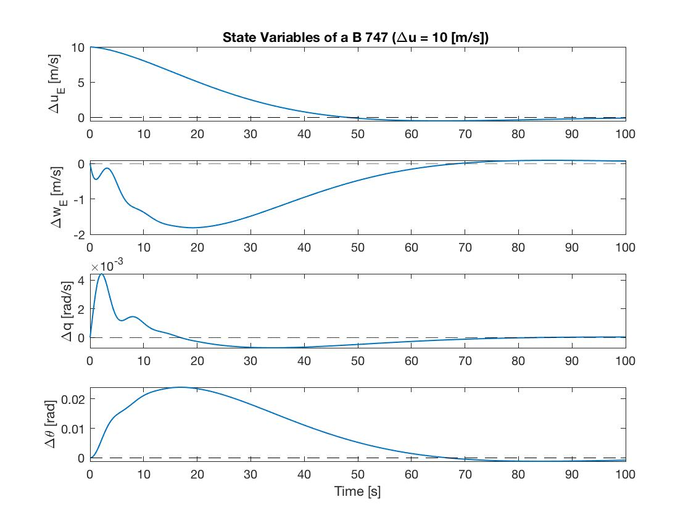 

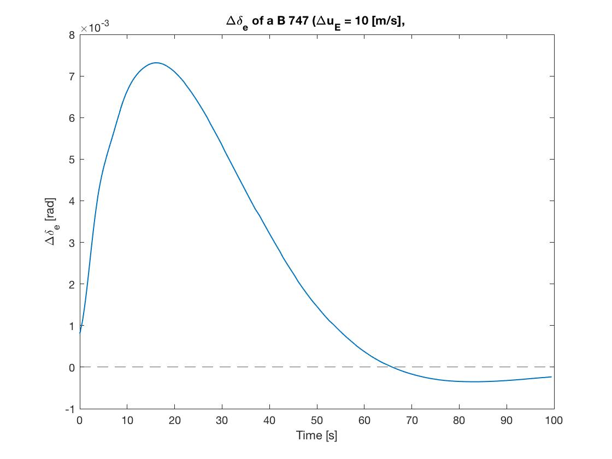 

When comparing the plots of the state variable response to the perturbation about $U_E$, for the closed loop control for the PD-control of the full longitudinal set versus the P-only control of the PWD approximation it was noticed that the time constants were much different. the dampening of the full set is much greater as the system returns much quicker to nominal conditions for the full set PD-control. This makes sense as the derivative gain should help the system's stability. The overshoot of the P-only system is also much larger due to this smaller dampening and stability, which also makes inherent sense.